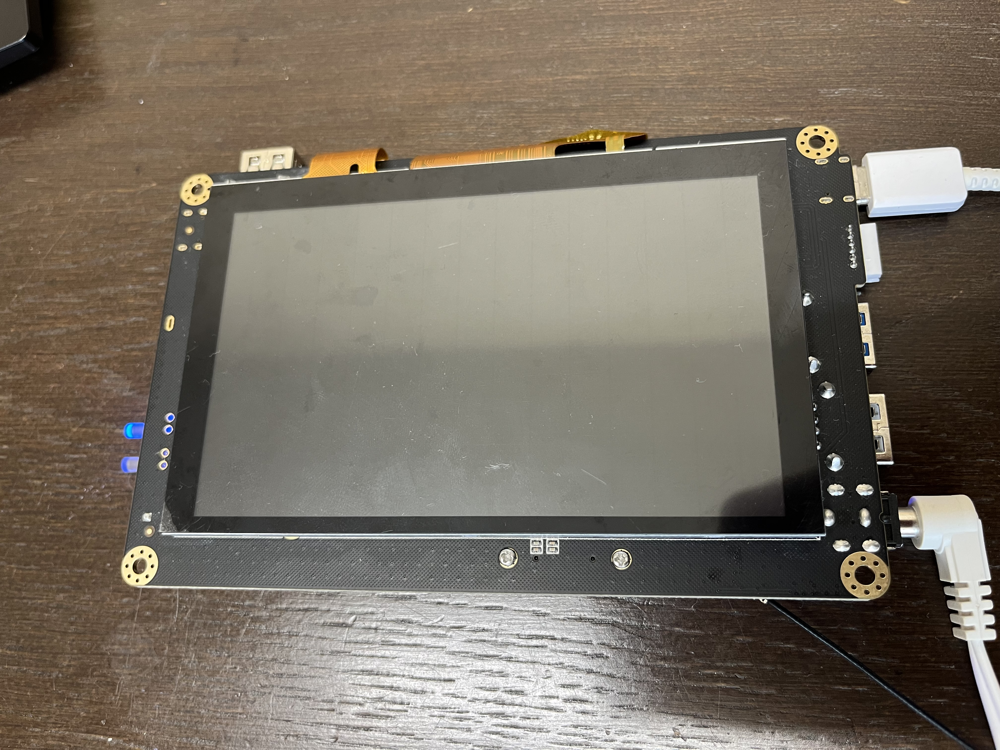
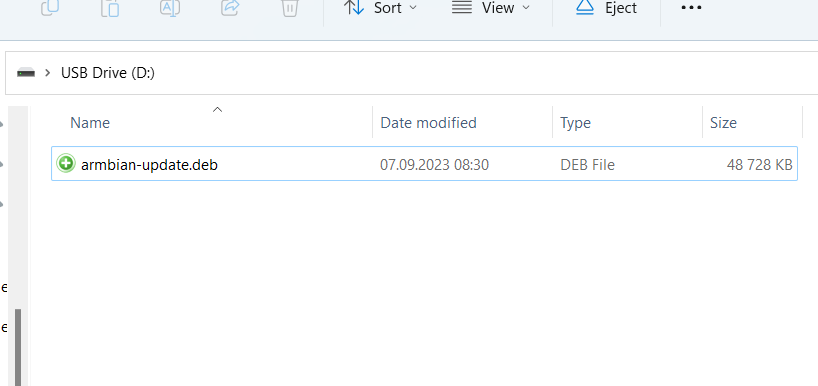
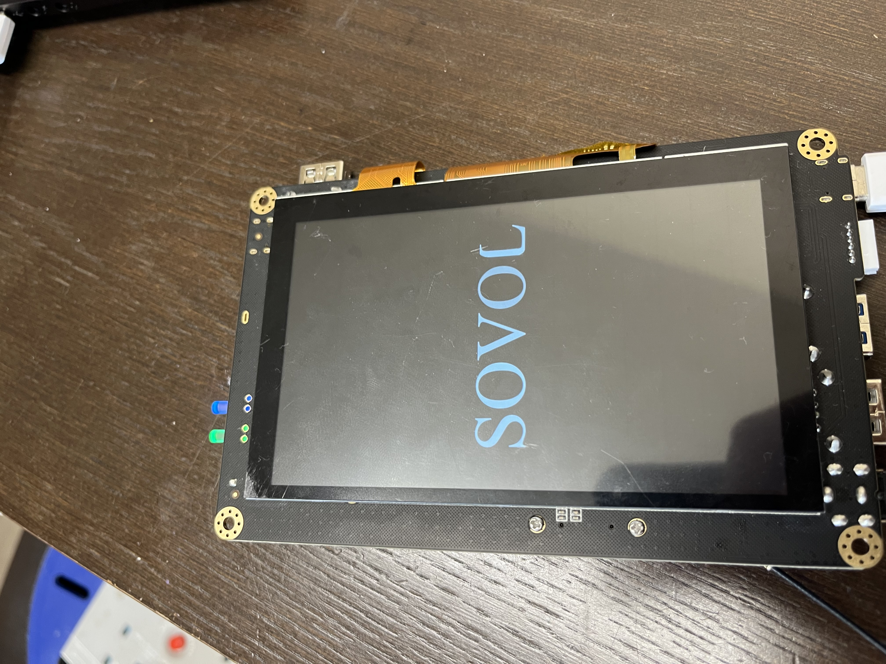

# Sovol SV07 / SV07 Plus recovery after system update

Recently, Sovol has released new printers - SV07 and SV07 Plus, super fast printers, Klipper based out of the box. Unfortunately, with this combination and hardware from MKS, it can be bricked easily when you update kernel, via apt update && apg upgrade for example, or when some other scripts/apps force your system to do it.
Right now there's no solution to prevent this from happening, you can only try to revive it. Depending of state of brick, you might just need USB flash drive with correct deb package or you might need to reflash whole EMMC memory in order to recover your printer. For now, there will be just a solution for 'basic' brick, where you have lost screen output, but you can still access printer via WiFi, theres also other person, Tomas, whos working on other solutions, that might be released soon as well.

# Basic "brick" after apt update && apt upgrade

That's pretty easy - if you still have access to your Klipper via WiFi, you only need USB drive, any size & type really, all it has to be is FAT32 formatted.
In this git, I have uploaded DEB file from Sovol (it's zipped and split into two parts, it won't let me upload file bigger than 25MB, so you have to download **BOTH** files and unzip it), it's matching SV07 and SV07 Plus, however please be aware - printer.cfg is different for both, because of size, so you might need to use yours or I'll provide stock cfg files here as well.

When you have file unzipped just copy it into your flash drive, without any directories inside, armbian-update.deb must be in main directory of your USB drive.

Turn on your "bricked" printer, give it a minute or two to start, LEDs at the top of screen should be flashing, that means it's booting, which is a good sign. Now plug in your flash drive into USB port, any should work, I've used blue USB 3.0 port, give it 2-3 minutes and it should automatically restart & you should have your screen working again, all on initial setup like when you started printer for the first time.

If it didn't happen and you didn't get your screen back, you need to follow other steps here, or follow Tomas's guide once it's released.

